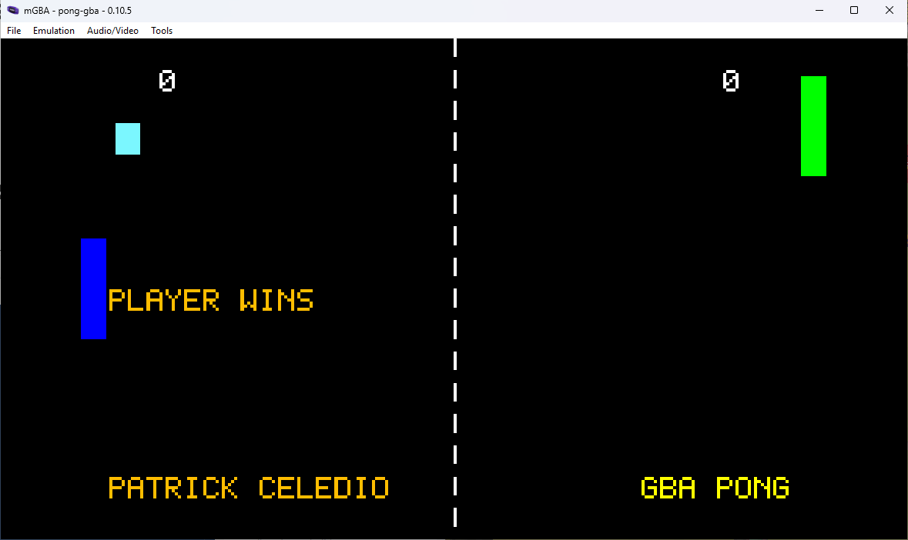
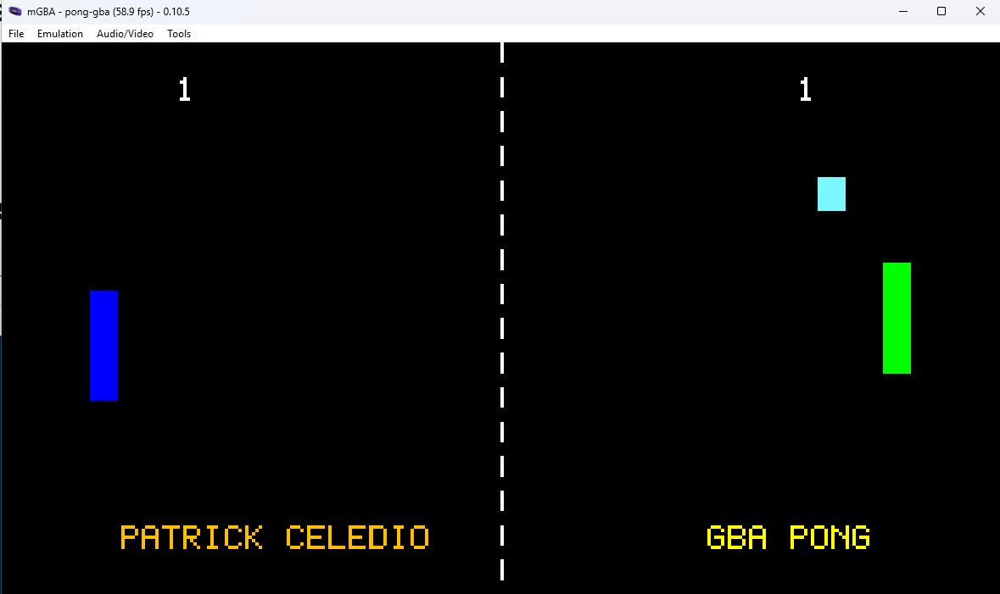
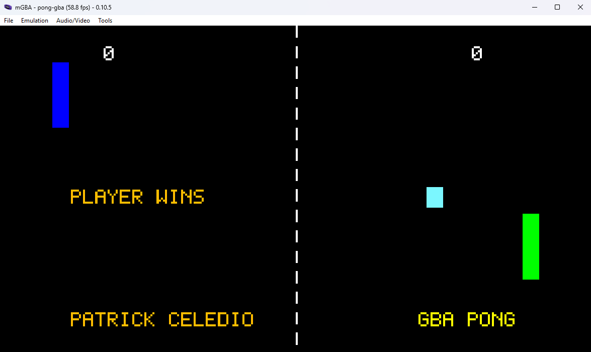

# pong-gba

My first attempt at making a complete video game for the Nintendo Game Boy Advance
in C language using devkitARM and libgba. 

# Environment Setup (Windows)

This project uses:

- devkitPro
- devkitARM
- libgba
- mGBA emulator

## DO THIS FIRST:
- Install devkitPro
    - Download and run the devKitPro installer from https://devkitpro.org/wiki/Getting_Started
        - Ensure to check off these libraries
            - devkitARM
            - gba-dev
            - libgba
- Have a GBA emulator on your PC (I use mGBA) https://mgba.io/downloads.html

# Building the Project

1) Go into "/c/dev/gba_dev/pong-gba" directory
2) Type and enter "make" to compile the .gba file
```
    Open PowerShell in the project directory:

    cd F:\Programming\pong-gba

    Build:

    make

    Expected output:

    main.c
    linking cartridge
    built ... pong-gba.gba
    ROM fixed!
```
3) Run pong-gba.gba on your favorite GBA emulator
```
    Run with mGBA:

    mgba .\pong-gba.gba

    Or open the `.gba` file manually in mGBA.

    Recommended emulator:

    - mGBA
```
# Issues:

- If you are getting an error along the lines of "Bad file descriptor" whenever
you attempt to make the .gba file... be sure to exit out of your gba emulation
instance....

- If VS Code terminals do not recognize `make`:

    1. Fully close VS Code
    2. Reopen VS Code
    3. Open a new terminal

    VS Code caches environment variables from when it launches.

- If you are getting something like, 
    ```
    "/f/Programming/pong-gba/build/main.d:1: *** multiple target patterns. Stop. make: *** [Makefile:118: build] Error 2"
    ```
    - Try the command ```make clean``` first in order to delete generated build files so the project can rebuild from scratch.

# Recommended Workflow
```
After changing source code:

make

If strange compiler/build errors occur:

make clean
make
```

# Screenshots



